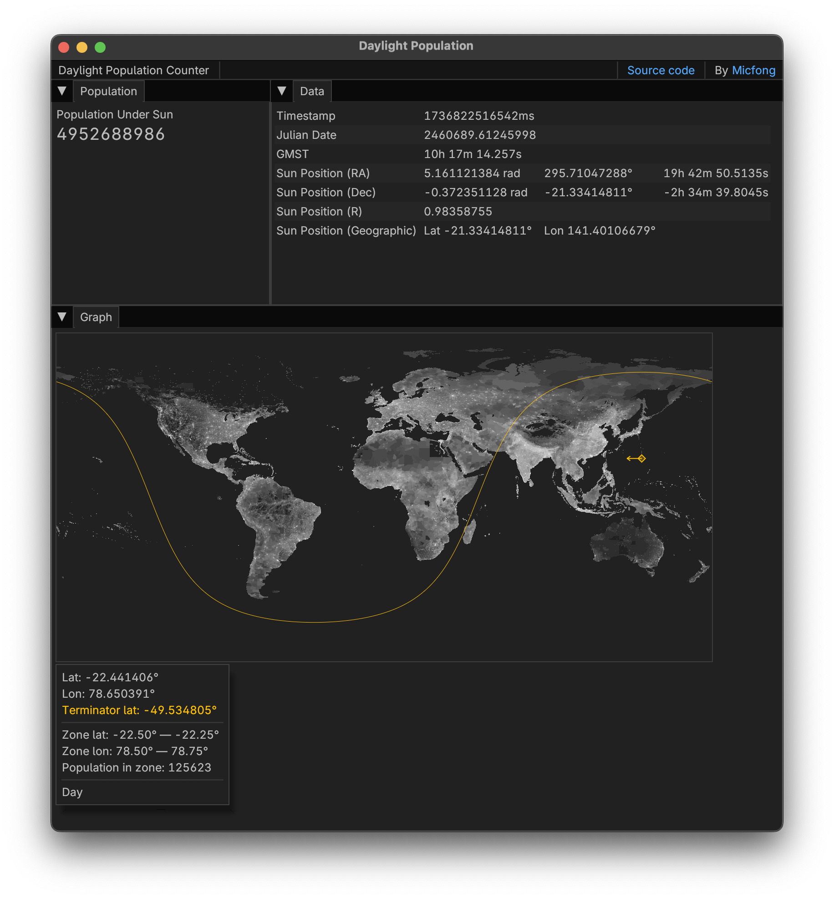

# Daylight Population Counter

A live-counter of the world's population that currently is in daylight. The counter can be accessed as a WASM app [here](https://daylight.micfong.space).

The counter does not use any online data source, but instead uses the GPWv4 dataset (see below) and a solar terminator algorithm to calculate the number of people currently in daylight.

The solar terminator may not be perfectly accurate as it assumes that:
- the Sun is infinitely far away from the Earth;
- the Earth is a perfect sphere.

The population dataset used is gridded per 15 arc-minutes.

## Data Sources

Center for International Earth Science Information Network - CIESIN - Columbia University. 2018. Gridded Population of the World, Version 4 (GPWv4): Population Count, Revision 11. Palisades, NY: NASA Socioeconomic Data and Applications Center (SEDAC). https://doi.org/10.7927/H4JW8BX5. Accessed 9 January, 2025.

Center for International Earth Science Information Network - CIESIN - Columbia University. 2018. Gridded Population of the World, Version 4 (GPWv4): Population Density, Revision 11. Palisades, NY: NASA Socioeconomic Data and Applications Center (SEDAC). https://doi.org/10.7927/H49C6VHW. Accessed 9 January, 2025.
